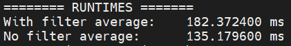
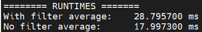

# Code-Optimization

C program that aims to improve and optimize a piece of code of another programmer.  

The original code is `original_code.c` and the optimized code is `optimized_code.c`.  

### Code improvements

During the optimization process i used `Gprof`.  

Some examples of the optimizations that i did:  
* Using Registers int insted int for variables that are in often use during the function (important to say - it is only a "recommendation for the compiler")
* Using macro expression, and make the math operation on the expression instead of doing it during compilation time
* Use #define instead of "small functions" - save the run-time call for function  
* etc

Before each function and significant action in the code, you can read the relevant notes.  
Besides those notes, you can see the improvments in the run-time:  

Original run-time code:  
 

Optimized run-time code:  
 
